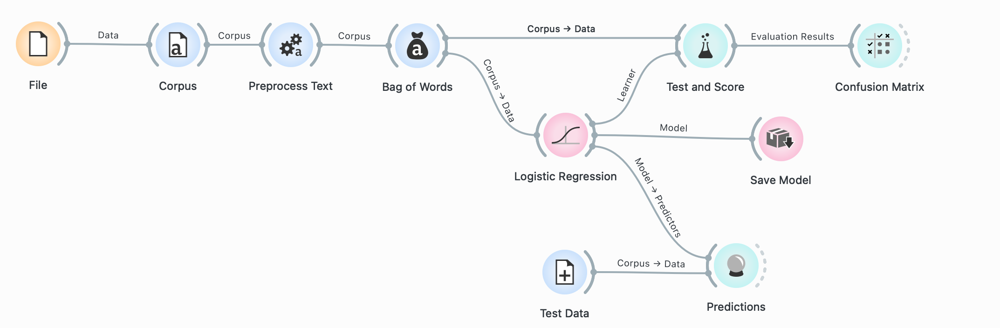
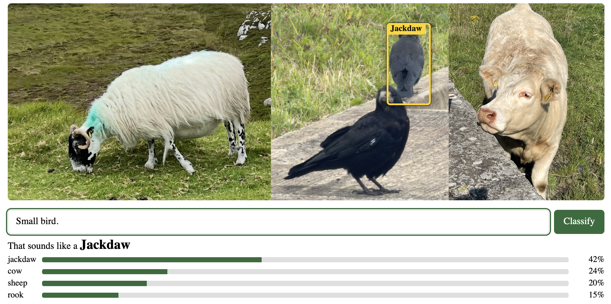

# Donegal fun classifier :D 

Silly project that embeds a text classifier model directly into an image.

Then the user can type descriptions, and the webpage reads the self-contained classifier.

The magic for the demo is in `create_image_with_classifier.py`. 

### Model creation.
Used [Orange](https://orangedatamining.com) to create the initial model.

### The pain
- Orange saves the model as a pickle, so had to convert it.
- Turns out Wordpress compresses the image if above a certain resolution. So had to factor that in.
- After setting up the initial html page it looked bland. So got an LLM to make it look nicer, and put boxes around the animal detected.

### Results
